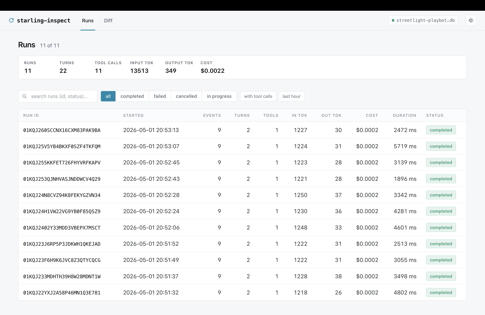

<div align="center">

```text
███████╗████████╗ █████╗ ██████╗ ██╗     ██╗███╗   ██╗ ██████╗
██╔════╝╚══██╔══╝██╔══██╗██╔══██╗██║     ██║████╗  ██║██╔════╝
███████╗   ██║   ███████║██████╔╝██║     ██║██╔██╗ ██║██║  ███╗
╚════██║   ██║   ██╔══██║██╔══██╗██║     ██║██║╚██╗██║██║   ██║
███████║   ██║   ██║  ██║██║  ██║███████╗██║██║ ╚████║╚██████╔╝
╚══════╝   ╚═╝   ╚═╝  ╚═╝╚═╝  ╚═╝╚══════╝╚═╝╚═╝  ╚═══╝ ╚═════╝
```

**Event-sourced ADK for Go**

Replayable runs · Tamper-evident logs · Provider-neutral tools · Production debugging

</div>

Starling is a Go runtime for building LLM agents where every run is recorded as
an append-only, BLAKE3-chained, Merkle-rooted event log. When an agent fails in
production, you can inspect the log, replay it against the same agent wiring, and
see exactly where today's behavior diverges from the original recording.

## Why Starling?

| If you need... | Starling gives you... |
| --- | --- |
| Debuggable agent runs | A complete event stream for prompts, tool calls, provider chunks, usage, budgets, and errors. |
| Portable replay | Deterministic re-execution from the recorded log, including MCP tool side effects. |
| Audit evidence | Hash-chained events and Merkle roots suitable for retention, review, and incident timelines. |
| Cost control | Token, USD, and wall-clock budgets enforced inside the runtime, not just observed after the fact. |
| Provider choice | OpenAI-compatible, Anthropic, Gemini, Amazon Bedrock, OpenRouter, and local/open model backends. |
| Operational visibility | Metrics hooks, structured divergence logs, and an embedded inspector UI. |

## Features

- **Event-sourced execution**: every meaningful runtime action is an event.
- **Deterministic replay**: recorded runs can be replayed without calling the
  model or re-running recorded side effects.
- **Durable event logs**: in-memory, SQLite, and Postgres backends with schema
  migration and validation helpers.
- **Provider adapters**: OpenAI-compatible APIs, Anthropic, Gemini, Amazon
  Bedrock, and OpenRouter.
- **MCP tools**: stdio subprocess and streamable HTTP clients backed by the
  official Go MCP SDK.
- **Tool safety**: retries, transient error classification, typed tool errors,
  max MCP output caps, and replay-safe side effects.
- **Inspector**: dependency-free browser UI for exploring runs and replay
  divergence.
- **Observability**: metrics wrappers, OpenTelemetry-friendly examples, and
  opt-in structured `slog` output (silent by default; pass
  `Config.Logger = slog.New(...)` to enable).

## Install

```bash
go get github.com/jerkeyray/starling@v0.1.0-beta.1
```

Pin a tag rather than tracking `main` — Starling is in beta and breaking
changes are permitted between beta cuts. See [Release policy](#release-policy)
and [CHANGELOG.md](CHANGELOG.md).

## Documentation

- [docs/getting-started.md](docs/getting-started.md) — install, your
  first agent, tools, durable storage, replay.
- [docs/mental-model.md](docs/mental-model.md) — what a Run is, when
  it terminates, when to use one Run versus many, what replay
  actually checks.
- [docs/faq.md](docs/faq.md) — quick answers to recurring questions.
- Cookbook: [branching](docs/cookbook/branching.md),
  [manual writes](docs/cookbook/manual-writes.md),
  [multi-turn](docs/cookbook/multi-turn.md).
- Reference: [events](docs/reference/events.md),
  [step primitives](docs/reference/step-primitives.md),
  [cost model](docs/reference/cost-model.md),
  [tools](docs/reference/tools.md),
  [replay](docs/reference/replay.md),
  [metrics](docs/reference/metrics.md),
  [save file](docs/reference/save-file.md).

[docs/README.md](docs/README.md) is the full index.

## Quickstart

```go
package main

import (
	"context"
	"fmt"
	"os"

	starling "github.com/jerkeyray/starling"
	"github.com/jerkeyray/starling/eventlog"
	"github.com/jerkeyray/starling/provider/openai"
)

func main() {
	ctx := context.Background()

	prov, err := openai.New(openai.WithAPIKey(os.Getenv("OPENAI_API_KEY")))
	if err != nil {
		panic(err)
	}

	log := eventlog.NewInMemory()
	a := &starling.Agent{
		Provider: prov,
		Log:      log,
		Config:   starling.Config{Model: "gpt-4o-mini", MaxTurns: 4},
	}

	run, err := a.Run(ctx, "Give me a three bullet incident summary.")
	if err != nil {
		panic(err)
	}

	fmt.Println(run.FinalText)
}
```

## Core Model

```text
Agent.Run
  -> provider.Stream
  -> tool execution
  -> budget checks
  -> append-only event log
  -> replay / inspect / resume
```

Starling treats the event log as the source of truth. The runtime records model
requests, streaming chunks, tool calls, usage, budget decisions, terminal states,
and replay metadata as structured events. Backends validate event ordering,
schema versions, and hash continuity.

## Durable Logs

Use SQLite or Postgres when runs must survive process restarts or be inspected
later.

```go
log, err := eventlog.NewSQLite("starling.db")
if err != nil {
	panic(err)
}
defer log.Close()
```

Durable backends support schema preflight checks, migrations, validation, and
retention workflows.

## Replay And Resume

Replay a recorded run against the same agent wiring:

```go
if err := starling.Replay(ctx, log, runID, a); err != nil {
	if errors.Is(err, starling.ErrNonDeterminism) {
		// Inspect the log for the first diverging event.
	}
	panic(err)
}
```

Resume continues from a persisted run while preserving call correlation and
budget accounting.

```go
next, err := a.Resume(ctx, runID, "Continue with remediation steps.")
```

## Providers

| Provider | Package | Notes |
| --- | --- | --- |
| OpenAI-compatible | `provider/openai` | OpenAI, Groq, Together, Ollama, vLLM, LM Studio, Azure OpenAI, and compatible APIs via custom `BaseURL`. |
| Anthropic | `provider/anthropic` | Messages API support, tool use, thinking/signatures, and prompt caching metadata. |
| Gemini | `provider/gemini` | Native Gemini adapter for Google models. |
| Amazon Bedrock | `provider/bedrock` | Native Bedrock ConverseStream adapter with AWS SDK auth, tool use, reasoning, and cache-aware usage. |
| OpenRouter | `provider/openrouter` | OpenRouter-specific convenience wrapper over the OpenAI-compatible path. |

Provider behavior is covered by a conformance suite so adapters share the same
streaming, usage, tool-call, and error contracts.

## MCP Tools

Starling can expose remote MCP tools as regular `tool.Tool` values.

```go
client, err := toolmcp.NewCommand(ctx,
	exec.Command("uvx", "mcp-server-filesystem", "/tmp"),
	toolmcp.WithIncludeTools("read_file", "list_directory"),
	toolmcp.WithMaxOutputBytes(64<<10),
)
if err != nil {
	panic(err)
}
defer client.Close()

tools, err := client.Tools(ctx)
if err != nil {
	panic(err)
}

a := &starling.Agent{
	Provider: prov,
	Log:      log,
	Tools:    tools,
	Config:   starling.Config{Model: "gpt-4o-mini", MaxTurns: 8},
}
```

Supported transports:

- `toolmcp.NewCommand(ctx, cmd, opts...)` for stdio subprocess servers.
- `toolmcp.NewHTTP(ctx, endpoint, httpClient, opts...)` for streamable HTTP servers.
- `toolmcp.New(ctx, transport, opts...)` for custom transports.

MCP tool calls are wrapped in `step.SideEffect`, so replay uses the recorded
result instead of contacting the remote MCP server again. Starling currently
supports MCP tools; resources, prompts, and sampling are intentionally deferred.

## Budgets And Retries

Budgets can cap input tokens, output tokens, USD cost, and wall-clock runtime.

```go
a := &starling.Agent{
	Provider: prov,
	Log:      log,
	Budget: &starling.Budget{
		MaxInputTokens:  20_000,
		MaxOutputTokens: 4_000,
		MaxUSD:          0.50,
		MaxWallClock:    30 * time.Second,
	},
	Config: starling.Config{Model: "gpt-4o-mini", MaxTurns: 8},
}
```

Tool retries are explicit and replay-aware:

```go
out, err := step.CallTool(ctx, step.ToolCall{
	CallID:      "fetch-ticket",
	TurnID:      turnID,
	Name:        "fetch_ticket",
	Args:        args,
	Idempotent:  true,
	MaxAttempts: 3,
})
```

## Inspector

```bash
go run ./cmd/starling-inspect starling.db
```



Loopback web UI: runs list with per-row totals, per-event timeline
with a syntax-highlighted JSON detail pane, and a `/diff` page
aligning any two runs side-by-side by sequence number. Dark by
default, theme toggle in the topbar, hashes and run ids are
click-to-copy, no CDN or JS build step. Runs read-only — `Append`
is impossible on the inspector's DB handle.

Full tour and screenshots in the
[docs site](https://github.com/jerkeyray/starling-docs).

## Production Checklist

- Run `make check` before release: format, vet, build, race tests, lint, and
  vulnerability scan.
- Pick a durable log backend for production runs: SQLite for single-node use,
  Postgres for shared infrastructure.
- Run eventlog preflight and migrations during deploys.
- Protect inspector access behind your normal internal auth boundary.
- Set explicit budgets for tokens, cost, and wall-clock runtime.
- Use idempotent retries and per-call timeouts for tools that touch external
  systems.
- Use replay regression tests for critical agent workflows.
- Store raw provider responses only when your privacy and retention policy
  allows it.

## Examples

| Example | What it shows |
| --- | --- |
| [examples/hello](examples/hello) | The smallest end-to-end agent (~50 lines). Start here. |
| [examples/m1_hello](examples/m1_hello) | Dual-mode pattern: run / inspect / replay / reset / show. |
| [examples/multi_turn](examples/multi_turn) | Chat-style workflow: one Run per user message. |
| [examples/branching](examples/branching) | `eventlog.ForkSQLite` to split a recorded run into a counterfactual branch. |
| [examples/manual_writes](examples/manual_writes) | Writing events without `Agent.Run`, including the Merkle root. |
| [examples/incident_triage](examples/incident_triage) | End-to-end production-style workflow with budgets, replay, resume, metrics, OTel, and durable logs. |
| [examples/mcp_tools](examples/mcp_tools) | MCP server tools adapted into Starling tools. |
| [examples/m4_inspector_demo](examples/m4_inspector_demo) | Local run data for the inspector. |

## Development

```bash
make check
```

Useful targets:

```bash
make test      # race-enabled Go test suite
make lint      # golangci-lint
make vuln      # govulncheck
make inspect   # run the inspector locally
make smoke     # quick end-to-end smoke run
```

## Release policy

Starling is in beta. Versions are tagged `v0.x.y-beta.N` and
distributed through Go module proxy.

- **Pin a tag.** Don't track `main`; the working branch may carry
  breaking changes between beta cuts.
- **Breaking changes are permitted between beta tags.** Each tag's
  delta is recorded in [CHANGELOG.md](CHANGELOG.md). Until GA there
  is no API or wire-format compatibility promise.
- **Within a tag, breakage is a bug.** A pinned beta is reproducible.
- **Schema versioning** for the event log is documented under
  [Event log schema](#event-log-schema) below — this is the one
  surface that has its own forward/back-compat contract.
- **GA (`v1.0.0`)** will land when the public API surface, event
  schema, and replay contract are stable enough to commit to. No
  date promised.

## Event log schema

`event.SchemaVersion` is the format version of the events written
into the log. Resume and replay both read this field and refuse runs
written by an unknown schema (`ErrSchemaVersionMismatch`).

- **When the constant bumps.** Whenever the wire-format of an event
  payload, the set of `event.Kind` values, or the canonical-encoding
  rules change in a way that affects the BLAKE3 hash chain.
- **What consumers must do.** Re-pin to the matching beta tag, then
  run `starling migrate <db>` (also exposed in-process as
  `starling.MigrateCommand`) to bring on-disk logs forward. The
  `starling schema-version <db>` command prints the current version.
- **Compatibility within a major-schema family.** Minor bumps must
  remain resume-compatible: an older agent binary should be able to
  resume a run written by a newer one whenever the new schema is a
  superset. Breaking format changes bump the major part and require
  the explicit `migrate` step.
- **Migrations live in `migrate_command.go`.** Each new on-disk
  format ships its forward migration alongside the schema bump in
  the same beta.

## License

Apache 2.0. See [LICENSE](LICENSE).
